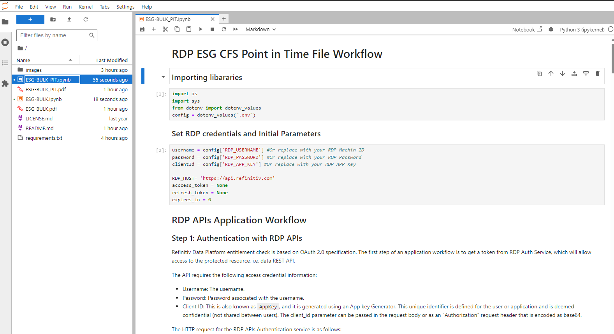
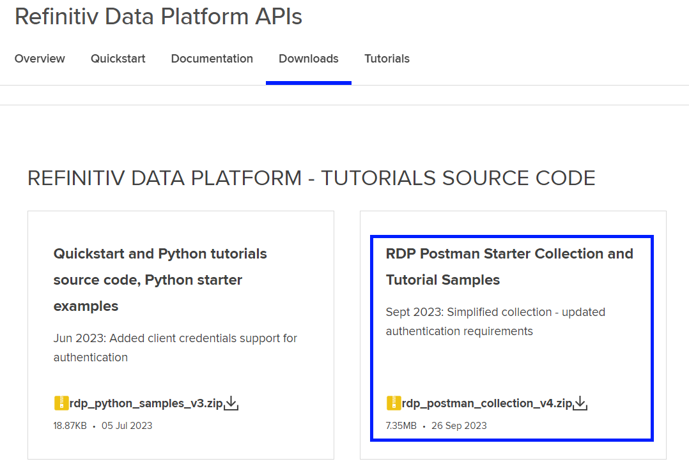
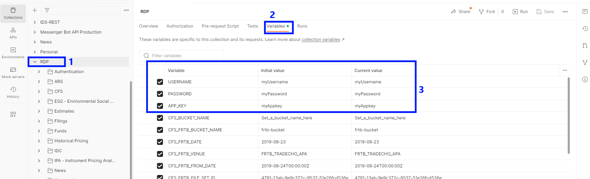
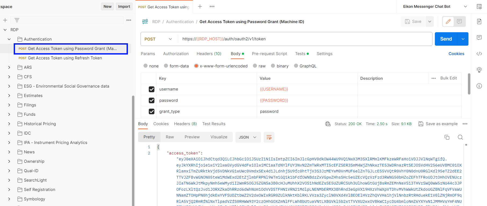
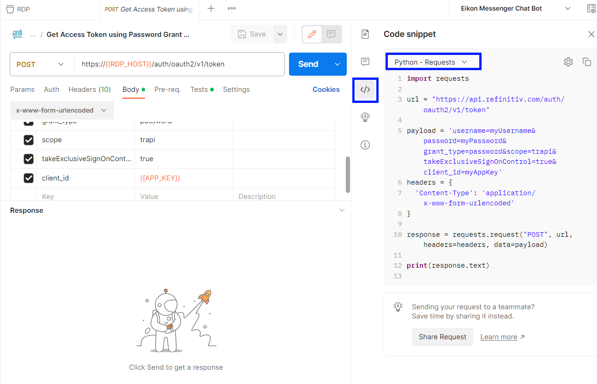
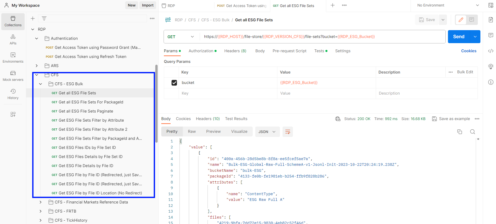
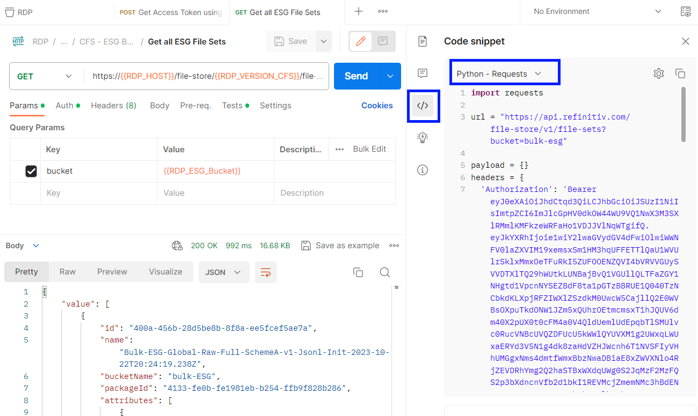

# RDP APIs ESG Point in Time CFS Bulk file Workflow
- version: 1.0.0
- Last update: Oct 2023
- Environment: Jupyter Notebook
- Prerequisite: [Access to RDP credentials](#prerequisite)

Example Code Disclaimer:
ALL EXAMPLE CODE IS PROVIDED ON AN “AS IS” AND “AS AVAILABLE” BASIS FOR ILLUSTRATIVE PURPOSES ONLY. REFINITIV MAKES NO REPRESENTATIONS OR WARRANTIES OF ANY KIND, EXPRESS OR IMPLIED, AS TO THE OPERATION OF THE EXAMPLE CODE, OR THE INFORMATION, CONTENT, OR MATERIALS USED IN CONNECTION WITH THE EXAMPLE CODE. YOU EXPRESSLY AGREE THAT YOUR USE OF THE EXAMPLE CODE IS AT YOUR SOLE RISK.

## <a id="intro"></a>Introduction

This demo application shows the workflow of the Refinitiv Data Platform (RDP) CFS Bulk API Feed for the ESG Point in Time data. I am demonstrating the workflow in [Python](https://www.python.org/) and [Jupyter](https://jupyter.org/) environment. However, the RDP APIs are the web-based API that any programming langues can connect and consume data from via the HTTP RESTful API. 

## <a id="prerequisite"></a>Prerequisite

Before I am going further, there is some prerequisite, dependencies, and libraries that the project is needed.

### Access to the RDP with the ESG Bulk file permission

This project uses RDP access credentials with the ESG Bulk file permission.

Please contact your Refinitiv representative to help you with the RTO account and services.

### Internet Access

This demonstration connects to RDP on AWS via a public internet.

### Python and Jupyter Notebook.

This project uses [Python](https://www.python.org/) and [Jupyter](https://jupyter.org/) environment.

The Python [Anaconda](https://www.anaconda.com/distribution/) or [MiniConda](https://docs.conda.io/en/latest/miniconda.html) distribution/package manager is recommended on.

## <a id="whatis_rdp"></a>What is Refinitiv Data Platform (RDP) APIs?

The [Refinitiv Data Platform (RDP) APIs](https://developers.refinitiv.com/en/api-catalog/refinitiv-data-platform/refinitiv-data-platform-apis) provide various Refinitiv data and content for developers via easy-to-use Web-based API.

RDP APIs give developers seamless and holistic access to all of the Refinitiv content such as Environmental Social and Governance (ESG), News, Research, etc, and commingled with their content, enriching, integrating, and distributing the data through a single interface, delivered wherever they need it.  The RDP APIs delivery mechanisms are the following:
* Request - Response: RESTful web service (HTTP GET, POST, PUT or DELETE) 
* Alert: delivery is a mechanism to receive asynchronous updates (alerts) to a subscription. 
* Bulks:  deliver substantial payloads, like the end-of-day pricing data for the whole venue. 
* Streaming: deliver real-time delivery of messages.

This example project is focusing on the Request-Response: RESTful web service delivery method only.  


For more detail regarding the Refinitiv Data Platform, please see the following APIs resources: 
- [Quick Start](https://developers.refinitiv.com/en/api-catalog/refinitiv-data-platform/refinitiv-data-platform-apis/quick-start) page.
- [Tutorials](https://developers.refinitiv.com/en/api-catalog/refinitiv-data-platform/refinitiv-data-platform-apis/tutorials) page.

## <a id="whatis_rdp"></a>About the ESG Point in Time Filesets.

Each week updates to the Environmental, Social and Governance (ESG) Point in time data are delivered to Refinitiv Data Platform (RDP). Refinitiv Bulk files are distributed in csv format, with the file extension .csv. 

Two types of data updates are available. 

• A full set of csv data files containing all history for all data items and all organizations.
• A delta csv data file that contains only incremental changes to the universe since last week. 

### Full Initialization Files
One zip file is created containing all organizations for one year of history. Both active and inactive organizations are included in 
the data file. Each zip file contains a separate csv file for each organization

### Delta Files
An incremental update is generated for each value that has changed since last week. The incremental update will contain only 
the values for an organization and period that have changed. Each zip file contains a single csv file containing all 
created/modified or deleted data for all organizations.

ESG PIT Files are published each Monday by 9am UTC.

The ESG csv files are zipped and delivered as .zip files.

For more detail regarding the ESG Point in Time Filesets, please see the following APIs resources: 
- [ESG Bulk - Point in Time User Guide](https://developers.lseg.com/en/api-catalog/refinitiv-data-platform/refinitiv-data-platform-apis/documentation#esg-bulk-point-in-time-user-guide)

## <a id="how_to_run"></a>How to run the demo application

The first step is to unzip or download the example project folder into a directory of your choice, then set up Python or Docker environments based on your preference.

### <a id="python_example_run"></a>Run the demo application

1. Open Anaconda Prompt and go to the project's folder.
2. Run the following command in the Anaconda Prompt application to create a Conda environment named *ESG* for the project.
    ``` bash
    (base) $>conda create --name ESG python=3.10
    ```
3. Once the environment is created, activate a Conda *ESG* environment with this command in Anaconda Prompt.
    ``` bash
    (base) $>conda activate ESG
    ```
4. Run the following command to the dependencies in the *ESG* environment 
    ``` bash
    (ESG) $>pip install -r requirements.txt
    ```
5. Once the dependencies installation process is success, create a ```.env``` file with the following content
    ``` INI
    RDP_USERNAME=<Your RDP Username>
    RDP_PASSWORD=<Your RDP Password>
    RDP_APP_KEY=<Your RDP App key>
    ```
5. Then run the following command to start the Jupyter Lab application.
    ``` bash
    (ESG) $>jupyter lab
    ```
6. Open a **ESG-BULK_PIT.ipynb**  file and run each cell to learn the ESG Point in Time workflow step by step.

    

7. Open a **ESG-BULK.ipynb**  file and run each cell to learn *a normal ESG* workflow step by step.

## <a id="postman_example"></a>Run the Postman application

For a step-by-step tutorials, please check the [RDP Postman tutorials](https://developers.lseg.com/en/api-catalog/refinitiv-data-platform/refinitiv-data-platform-apis/tutorials#authorization-and-time-series-summary-bar-in-postman) page.

1. Download the RDP Postman collection from the [Refinitiv Data Platform APIs download](https://developers.lseg.com/en/api-catalog/refinitiv-data-platform/refinitiv-data-platform-apis) page.

    

2. Unzip and import the *latest* collection file (*RDP.postman_collection_20230926.json* as of October 2023) to the Postman application.
3. Click on the *RDP* collection, then click the *Variables* tab and input your RDP Credential.

    

4. The first step is run the "Get Access Token using Password Grant (Machine ID)" request under the Authentication folder.

    

5. Please note that you can generate the Python code from this Postman request by clicking the ```</>``` button and choose Python.

    

6. Once the Once authentication is successful, run the requests under "CFS/CFS-ESG Bulk folder"
    
    

5. Like the Authentication request, you can generate the Python code from this Postman request by clicking the ```</>``` button as well.

    

## Next Steps

You may interested in the following resources for more detail about the ESG data usage:
- [Integrating ESG PiT Data to my StarMine Quant Model using AWS](https://developers.lseg.com/en/article-catalog/article/integrating-esp-pit-data-to-my-starmine-quant-model-using-aws)
- [Find environmental footprint of your bond portfolio](https://developers.lseg.com/en/article-catalog/article/Environmental_footprint_of_bond_portfolio) article
- [How to integrate ESG data into investment decisions](https://developers.lseg.com/en/article-catalog/article/how-integrate-esg-data-investment-decisions)
- [Find out the ESG and Geographic exposure of a portfolio](https://developers.lseg.com/en/article-catalog/article/understand-and-analyze-your-portfolios-esg-exposure)
- [Gathering aggregated ESG data on companies](https://developers.lseg.com/en/article-catalog/article/gathering-aggregated-esg-data-on-companies--esgbooleandata-pytho)

And much more on the [Developer Portal](https://developers.lseg.com/en) website.

## <a id="references"></a>References

That brings me to the end of my unit test example project. For further details, please check out the following resources:
* [Refinitiv Data Platform APIs page](https://developers.refinitiv.com/en/api-catalog/refinitiv-data-platform/refinitiv-data-platform-apis) on the [Refinitiv Developer Community](https://developers.refinitiv.com/) website.
* [Refinitiv Data Platform APIs Playground page](https://api.refinitiv.com).
* [Refinitiv Data Platform APIs: Introduction to the Request-Response API](https://developers.refinitiv.com/en/api-catalog/refinitiv-data-platform/refinitiv-data-platform-apis/tutorials#introduction-to-the-request-response-api).
* [Refinitiv Data Platform APIs: Authorization - All about tokens](https://developers.refinitiv.com/en/api-catalog/refinitiv-data-platform/refinitiv-data-platform-apis/tutorials#authorization-all-about-tokens).
* [Limitations and Guidelines for the RDP Authentication Service](https://developers.refinitiv.com/en/article-catalog/article/limitations-and-guidelines-for-the-rdp-authentication-service) article.
* [Getting Started with Refinitiv Data Platform](https://developers.refinitiv.com/en/article-catalog/article/getting-start-with-refinitiv-data-platform) article.
* [ESG Data Guide](https://developers.lseg.com/en/api-catalog/refinitiv-data-platform/refinitiv-data-platform-apis/documentation#esg-data-guide)
* [ESG-Bulk CFS API User Guide](https://developers.lseg.com/en/api-catalog/refinitiv-data-platform/refinitiv-data-platform-apis/documentation#esg-bulk-cfs-api-user-guide)
* [ESG Bulk - Point in Time User Guide](https://developers.lseg.com/en/api-catalog/refinitiv-data-platform/refinitiv-data-platform-apis/documentation#esg-bulk-point-in-time-user-guide)

For any questions related to Refinitiv Data Platform APIs, please use the [RDP APIs Forum](https://community.developers.refinitiv.com/spaces/231/index.html) on the [Developers Community Q&A page](https://community.developers.refinitiv.com/).